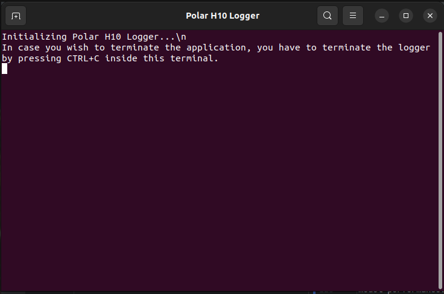

# MuseMeUp

This repo includes an application (named `musemeup.sh`), that includes the Mood Estimation model (MEA), together with the 
ECG logger and stress estimation model (SEA). The models' results are fed in the Music Generation component, where  
a piece of music tailored to the user’s emotional state and experience is synthesized and played, in real-time.  


## Introduction

**Mood Estimation Algorithm (MEA):**

MEA application captures video frames using a connected camera device (or the PC's camera), and sends the frames to a specified server via HTTP.
The HTTP transmission is primary meant to be used for dashboards or Web-UIs that show some of the captured frames. 

Also, the video frames are fed into the Facial Emotion Recognition (FER) model, which predicts if the person's emotion is "positive", "negative", "neutral" or "other", 
and displays the predicted class with a confidence score on the video frames. 
After the session's termination, the video is locally saved, and a JSON file with the model's predictions is exported.
The script supports dynamically setting video resolution and frame rate based on predefined options.


**ECG Logger and Stress Estimation Algorithm (SEA):**

The ECG Logger connection and Stress Estimation model is a tool for collecting raw ECG data from [PolarH10](https://www.polar.com/en/sensors/h10-heart-rate-sensor?srsltid=AfmBOoqTYMlnT3PEawTFMwP7xgEdMqz3nrCd1iyT5MyJlAzyFpGBX5CE) sensor, monitoring sensor connections, and estimating stress levels in real-time.


The setup involves three components, each operating in its dedicated environment to ensure modularity and avoid conflicts. These components include:

1. Dashboard Application: Visualizes sensor data and connection status in real-time.
2. ECG Logger: Records raw ECG data in configurable sessions and saves the recordings in a csv file.
3. Stress Estimation Model: Processes ECG data to predict stress levels and outputs results in a structured JSON format.

**Music Generation**

The Music Generation Component produces personalized musical pieces by applying music theory rules that link specific musical elements to emotional responses and cultural context.
The generated music is influenced by the user’s mood. For example, if the model detects mostly happy expressions, the music follows a major key with uplifting characteristics. For sadder moods, the music shifts to a minor key, producing a more melancholic feel. 


**Note: The particular project was built for Linux OS, and KAFKA is not included in the SEA setup (like in the older version of
[SEA CNN Inference](https://gitlab.catalink.eu/catalink/museit/sea-cnn-inference)).**


## Preparations before execution:


1. **Grant permissions**:
First of all, run chmod to grant permissions for executables:
 
```bash
cd <application_folder>

find . -type f -name "*.sh" -exec chmod +x {} \;

```

2. **Install Anaconda** from [https://docs.anaconda.com/anaconda/install/](https://docs.anaconda.com/anaconda/install/).

Save the location where Anaconda3 is installed (for example, /home/user_name/anaconda3).
The musemeup.sh script includes commands:

```bash
if [ -x "$HOME/anaconda3/bin/conda" ]; then
    conda_base="$HOME/anaconda3"
    echo "Found Anaconda installation"
elif [ -x "$HOME/miniconda3/bin/conda" ]; then
    conda_base="$HOME/miniconda3"
    echo "Found miniconda installation"
else
    echo "No conda installation found!"
    exit 1
fi
```

and it should be able to correctly locate the Anaconda3 location, but in case you face any issues related to conda-related missing 
packages, then manually adjust the path of `conda_base`, for example: 

```bash 
conda_base=/home/user_name/anaconda3
```
or
```bash 
conda_base=/home/user_name/miniconda3
```

3. **Install system-wide dependencies needed for the music generation service**, using root privileges:

```bash 
cd <application_folder>/musicgen

sudo bash ./install_deps.sh
```

4.  **Connect to PolarH10 sensor via Bluetooth.** Wear the PolarH10 sensor appropriately and connect the sensor with your PC.
Sometimes Ubuntu have trouble connecting to PolarH10, or the sensor gets disconnected after a while. In this case, follow these steps:


_**Image 1: Polar is disconnected.**_


_**Image 2: Remove polar from list of devices.**_


If the sensor is disconnected, remove it from the list (Remove device), and wait for bluetooth to discover it again. 
When it does, try to connect again.


_**Image 3: Polar connected successfully**_


5. Adapt the session configuration through the **`example_session_config.json`** (saved in `<application_folder>/SEA_APP_Nov24/polar-h10-ecg-logger`) which defines the segments' label and length.
In the **`example_session_config.json`** adjust the values according to your experiment: 
   1. Define the **`device_address`** of your Polar device (you can find the device address on the Bluetooth window, see Image 2)
   2. Define the **`segments`** of the session (one segment or more). For each segment provide a label and the duration length in seconds.
   For example:

```json
{
  "session_id": "1",
  "person_id": "1",
  "device_address": "A0:9E:1A:E0:D7:00",
  "segments": [
    {
      "label": "Composition",
      "duration": 120
    }
  ]
}
```


6. When you are done with all the aforementioned steps, open a terminal and navigate to the application folder. 
Run the following command:

```bash
cd <application_folder>

./musemeup.sh 

```
7. You can also track the logs of the applications by running on three separate terminals: 

```bash

cd <application_folder>

tail -f logs/dashboard.log

tail -f logs/stress_estimation.log

tail -f logs/polar_logger.log

tail -f logs/video_capture.log

tail -f logs/musicgen.log
```

### Terminal outputs:


***Image 4: Main terminal output (tracks the musemeup.sh)***


***Image 5: Dashboard logs (tracks the dashboard)***


***Image 6: Stress estimation model logs (tracks the stress estimation model)***




***Image 7: Logger emulator logs***


***Image 8: ECG Logger logs: StandBy mode***


***Image 9: ECG Logger logs: Composition mode***

### Computational resources
The bash script will run fine without a GPU, but performance may be slower compared to running on a GPU. None 
of the libraries or executables needed for the tools' execution require a GPU to function.


-------------------------------------------------
# Bash script overview

## Directory Structure
sea_mea_integrated_May25 directory contains the following folders:

- **`logs`**: Directory where logs are saved.
- **`museit-video-capture-with-FER-and-http-frame-transmission`**: Contains the video capture and mood estimation model
- **`SEA_APP_Nov24/polar-h10-ecg-live-dashboard`**: Contains the Dashboard application.
- **`SEA_APP_Nov24/polar-h10-ecg-logger`**: Contains the Polar H10 ECG Logger application.
- **`SEA_APP_Nov24/sea-cnn-inference`**: Contains the stress estimation model application.
- **`musicgen`**: Contains the music generation application.

The bash script **musemeup.sh** at the beginning checks if x-terminal-emulator
is installed, and if it's not, then it installs it. 
Afterwards, it checks if the appropriate conda environments and venv exist, and if they don't, it sets up four separate conda 
environments (one for each tool, in order to avoid having any conflicts between libraries/packages), and another python venv for the music generation app.


### Step 1: Dashboard Application
Step 1 runs a simple **Dashboard** to track the sensor connection status and the data collection process. 
By default, the Dashboard runs at **[http://0.0.0.0:8050/](http://0.0.0.0:8050/)**, but this can be modified by changing the parameters

- `dashboard_ip_address="0.0.0.0"`
- `dashboard_port="8050"`

inside the script **musemeup.sh**.


_**Image 10: Dashboard**_


_**Image 11: Dashboard displaying PolarH10 sensor data**_


### Step 2: Video Capture and Mood Estimation App

In step 2, the `main_semkg_dataexport.py` (main file of the MEA application) file is called, along with the `$dashboard_ip_address` and `$dashboard_port` parameters.
After this step, the video frames should be displayed on the Dashboard.


_**Image 12: Dashboard displaying video frames and real-time FER predictions**_


### Steps 3 and 4: Logger and Stress Estimation Model
Steps 3 and 4 work together to log ECG data and estimate the user's stress levels.
In particular, step 4 includes the  **Polar H10 ECG Logger**, a Python application 
for recording raw ECG data from a Polar H10 heart rate sensor. The Polar H10 ECG Logger application allows users to 
define sessions with multiple segments, track session progress, and record ECG readings.
This logger communicates with the real time **Stress Estimation Model**  (step 3) which includes a **ZeroMQ server**, that serves 
as an intermediary for live heart rate sensor data. The **ZeroMQ server** sends heart rate data to clients and the ZeroMQ 
client connects to the server and continuously receives heart rate data in real-time and processes it (i.e. it feeds them 
to stress estimation model to make some predictions) and the predictions are printed on the terminal.

Users can adapt the session configuration through the **`example_session_config.json`** (saved in `<application_folder>/SEA_APP_Nov24/polar-h10-ecg-logger`) which defines the segments' length.
In the **`example_session_config.json`** adjust the values according to your experiment: 
1. Define the **`device_address`** of your Polar device
2. Define the **`segments`** of the session (one segment or more). For each segment provide a label and the duration length in seconds.
For example:

```json
{
  "session_id": "1",
  "person_id": "1",
  "device_address": "A0:9E:1A:E0:D7:00",
  "segments": [
    {
      "label": "Composition",
      "duration": 120
    }
  ]
}
```

As soon as **step 4 (ECG logger)** starts to run, a pop-up terminal opens (see Image 7), and the sessions are in 
"StandBy" mode. During "StandBy" mode period, the sensor gathers data for standardization purposes. The "StandBy" period lasts for 30 seconds, and once it ends, the sessions as defined 
in the **`example_session_config.json`** begin automatically (for this example, the "Composition" segment begins). At this time period, the application feeds 
ECG data to the stress estimation model to make predictions. One prediction is made every 30 seconds (as defined by the parameter `PREDICTION_FREQUENCY_SEMKG_SEC`). The json file with the stress 
estimation predictions is initially created when the first prediction is made, and then the file is updated every 
`PREDICTION_FREQUENCY_SEMKG_SEC` seconds, with the new predictions. 


**NOTE:** It takes roughly 60 seconds to produce the first prediction (and export it in the `results_semkg.json` file), so you should define a session of at least 65 seconds in the 
`<application_folder>/SEA_APP_Nov24/polar-h10-ecg-logger/example_session_config.json` (segments definition) in order to get the `results_semkg.json` file.

Users must wait for the defined time segments to finish. Do not interrupt the process manually; sessions will automatically end once the duration has elapsed. 
Once the defined segments complete, the logger and stress estimation applications will terminate automatically.  In the polar_logger.log you will see these messages:


Additionally, raw ECG recordings will be saved in the location `<application_folder>/SEA_APP_Nov24/polar-h10-ecg-logger/session_output`, while stress estimation predictions will be saved 
in a json file (saved in the location `<application_folder>/SEA_APP_Nov24/sea-cnn-inference/src/online_inference/results`).

### Step 5: Music Generation
The generated music is influenced by the user’s mood, which is estimated by the  Mood Estimation and the Stress estimation models. 

In case the PolarH10 sensor is not connected, the Music Generation component is still running, based only on the
Mood Estimation predictions.

### MuseMeUp shut down
To shut down everything press CTRL+C in the main terminal and the Music Generation terminal.

### All in all, after the session ends the following files are saved:

* raw ECG recordings will be saved in the location `<application_folder>/SEA_APP_Nov24/polar-h10-ecg-logger/session_output`

* stress estimation predictions will be saved in the location `<application_folder>/SEA_APP_Nov24/sea-cnn-inference/src/online_inference/results`

*  Mood Estimation application exports the recorded video and a json file including the model's predictions (json is compatible with the SemKG format). These files will be saved in 
`<application_folder>/museit-video-capture-with-FER-and-http-frame-transmission/results`

* Music pieces will be saved in a .midi format in the location `<application_folder>/musicgen/liveMidiFiles`

### Troubleshooting

1. The app tries to establish bluetooth connection with the PolarH10 sensor for 40 seconds. If the connection with the sensor 
fails within this period, it displays a warning and skips the Stress Estimation model steps while continuing the script. I.e. only
the Mood Estimation model will run.

2. The following error indicates that PolarH10 got disconnected. Ensure PolarH10 is connected with the PC.


_**Image 11: PolarH10 disconnected**_


### Open issues (non-blocking):

1. Windows WSL: WIll try to run the bash script on windows WSL --> Having issues because, currently, WSL does not support Bluetooth connectivity.


**License**

Please make sure to read the license terms and conditions as outlined in the LICENSE file included in this repository. It's important to understand the usage rights and restrictions for this software.

**Support**

For any assistance or feedback, please contact Georgia Christodoulou or Vasilis Papadopoulos.


